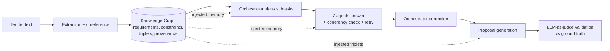

# Knowledge Graphs as Structured External Memory for Multi-Agent LLM Systems

A research prototype that uses an RDF **knowledge graph as shared external memory** for a
system of orchestrated LLM agents, applied to the automatic generation of **public
call-for-tender (CFT) responses**.

The system extracts the client's requirements and constraints from a tender document into a
provenance-aware knowledge graph, then injects that graph into a multi-agent pipeline that
drafts a bid on behalf of a bidding company. The repository is built as an **experimental
harness**: the same pipeline can be run across different injection strategies, serialization
formats, extractors, and chunk granularities, and the resulting proposals are scored against
a ground truth with an LLM-as-judge.

This code accompanies a Master's research internship at the **Wimmics** team (Inria,
Université Côte d'Azur, CNRS, I3S), in collaboration with the industrial partner Forgeron3.

---

## Idea

A single LLM given a full tender and a full company profile tends to lose track of individual
requirements and to hallucinate capabilities. The hypothesis here is that turning the tender
into a **structured graph** (one node per requirement and constraint, with provenance back to
the source text) and giving the agents that graph as memory produces proposals that satisfy
more of the client's requirements while spending fewer tokens than passing raw text.

The pipeline lets you switch that memory on and off at different points and compare the
outcomes.

---

## Architecture

### Agents

A central **orchestrator** coordinates seven specialised agents, each with its own JSON
context describing the bidding company from that role's perspective:

| Agent | Role |
|-------|------|
| `ProjectCoordinator` | Consortium lead, PM methodology, public-sector references |
| `TechnicalArchitect` | Technical architecture, stack, hosting, integration |
| `SecurityCompliance` | Certifications, GDPR, EU AI Act, SecNumCloud, NIS2 |
| `Legal` | Eligibility, contractual and regulatory risk, IP, insurance |
| `Budget` | Financials, cost estimation, margins, eligibility thresholds |
| `AIInnovation` | LLM stack, RAG, fine-tuning, explainability, benchmarks |
| `CSRSustainability` | EcoVadis rating, carbon footprint, green hosting, AI ethics |

Each agent answers strictly from its own context and runs a self **coherency check** on its
own reply (returning `TRUE`/`FALSE`); on failure it retries up to four times before the
orchestrator applies a final correction pass.

### Knowledge graph

The graph is an `rdflib` `ConjunctiveGraph` organised into named-graph families:

- **Requirements** and **Constraints** extracted from the tender
- **Triplets** extracted from the agent conversations
- **Proposals**
- **Provenance** (PROV-O), at chunk-level granularity

Every extracted triple keeps a provenance chain back to its source:

```
triplet  ──prov:wasDerivedFrom──▶  chunk  ──prov:wasDerivedFrom──▶  message  ──prov:wasAttributedTo──▶  agent
```

The graph is serialised to TriG on disk (`Total*.trig`) and injected into prompts in one of
three formats: **Turtle Light** (a compact custom serialisation, the default), **JSON**, or
**YAML-LD**.

### Pipeline



---

## Injection strategies

The core experimental variable is **where** the knowledge graph is injected. Each mode maps
to a CLI flag:

| Flag | Mode | Knowledge graph is given to |
|------|------|-----------------------------|
| `--c-null` | `C_null` | nobody (text-only baseline) |
| *(default)* | `C_{O}` | orchestrator only |
| `--c-op` | `C_{OP}` | orchestrator; agents receive the raw tender text |
| `--c-oa` | `C_{OA}` | orchestrator and agents |
| `--c-oap` | `C_{OAP}` | orchestrator, agents, and the final proposal (triplets injected) |

---

## Repository structure

```
.
├── main.py                     # Entry point and experiment CLI
├── Orchestrator_agent.py       # Planning, KG serialisation, correction, proposal
├── agent.py                    # Agent class, roles, coherency check, registry
├── custom_graph.py             # KG construction, named graphs, PROV-O provenance
├── utils.py                    # Ollama wrapper, token counter, chunking
├── mxg.py                      # Message model
├── CoreferenceResolver.py      # Coreference resolution before extraction
│
├── requirementsExtractor.py    # llama-based extractors
├── constraintsExtractor.py
├── proposalsExtractor.py
├── tripletExtractorClaude.py
├── phi4*Extractor.py           # phi4 "adaptable IE" extractor variants
│
├── {Belval,Chrb,Cabinet}_cft/  # One folder per tender scenario
│   ├── file.txt                #   the tender text
│   ├── contexts/*.json         #   one company context per agent
│   └── validation/             #   ground-truth requirements.json / constraints.json
│
├── experiments/                # Generated outputs (logs, .trig, validations, tokens)
├── plot*/ , plotting/          # Result plotting scripts
└── ranking/                    # Injection-point ranking across scenarios
```

Three tender scenarios are included: **Belval** (a municipal AI assistant for the City of
Belval), **CHRB** (a regional hospital), and **Cabinet** (an accounting practice). The
example bidder is Nexus Engineering S.r.l.

---

## Requirements

- Python 3.9
- A running [Ollama](https://ollama.com) server
- Python packages: `ollama`, `rdflib`, `pyyaml`, `fastcoref`, `matplotlib`, `numpy`

```bash
pip install ollama rdflib pyyaml fastcoref matplotlib numpy
```

Pull the models used for generation, judging, and extraction:

```bash
ollama pull llama3.3:70b
ollama pull hf.co/FinaPolat/phi4_adaptableIE_v2-gguf:Q4_K_M
```

`llama3.3:70b` is used for planning, agent answers, proposal writing, and validation. The
extractor backend is selectable (`llama` or `phi4`).

---

## Usage

Run one experiment from the repository root:

```bash
# Text-only baseline on the Belval tender
python main.py --cft belval --c-null

# Full injection: KG to orchestrator, agents, and proposal, in Turtle Light
python main.py --cft belval --c-oap --kg-format turtle-light --extractor phi4

# KG to orchestrator and agents, JSON format, no raw tender text passed to agents
python main.py --cft chrb --c-oa --kg-format json --no-text
```

### Options

| Option | Values | Default | Meaning |
|--------|--------|---------|---------|
| `--cft` | `belval`, `chrb`, `cabinet` | `belval` | Tender scenario |
| mode | `--c-null`, `--c-op`, `--c-oa`, `--c-oap` | `C_{O}` | Injection strategy |
| `--kg-format` | `json`, `turtle-light`, `yaml-ld` | `turtle-light` | Graph serialisation in prompts |
| `--extractor` | `llama`, `phi4` | `phi4` | Extraction backend |
| `--no-schema` | flag | off | phi4 only: extract without a schema |
| `--no-text` | flag | off | Drop raw tender text where the KG is injected |
| `--chunk-dimension` | `0`..`100` (step 10) | `0` | Chunk size as a percentage of the document (`0` = one sentence per chunk) |

---

## Outputs

Each run writes to `experiments/<cft>/.../<mode>_<chunk>/`:

- `Conversation.log` : full orchestrator and agent trace
- `Total*.trig` : the serialised knowledge graph
- `single_validation*.txt` : per-item satisfaction results
- `tokens.json` : prompt, completion, and total token usage

---

## Evaluation

Proposals are scored with an **LLM-as-judge** (`llama3.3:70b`) against the ground-truth
requirements and constraints in each scenario's `validation/` folder. Each requirement and
constraint is judged individually as satisfied or not, and the pipeline reports the
percentage satisfied together with token consumption, so quality and cost can be compared
across configurations.

The scripts in `plotting/`, `plot/`, `plot_chunk/`, and `ranking/` aggregate the runs to
compare serialisation formats, extractors, injection points, and chunk granularity.

---

## Reported results

On the tested scenarios, injecting the knowledge graph as external memory improved coverage
over the text-only baseline while lowering token consumption, with the strongest results from
the `C_{OAP}` strategy in Turtle Light. As reported in the accompanying thesis, requirement
satisfaction rose from 47% to 73% and constraint satisfaction from 68% to 84% relative to the
`C_null` baseline. See the thesis for the full evaluation.

---

## Author

**Mattia Sernia** — Master's in Data Science and Engineering (Politecnico di Torino /
EURECOM), research internship at Wimmics (Inria, Université Côte d'Azur, CNRS, I3S).
